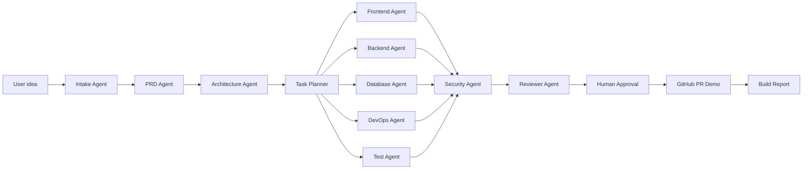

# BuildOS

Idea to app, automatically.

BuildOS is an AI-powered software-building operating system that turns a product idea into a PRD, technical architecture, task breakdown, generated full-stack starter code, GitHub pull request plan, CI/CD workflow, build/test report, security review, and improvement suggestions.

## Overview

BuildOS is a production-style MVP for demonstrating AI agent engineering, full-stack development, backend architecture, DevOps workflow, platform safety, and product thinking. It is an independent flagship project, not connected to any existing company.

## Problem

Teams waste time translating product intent into requirements, architecture, implementation tasks, repository setup, CI/CD, and deployment readiness. Normal chatbots stop at text or code snippets and do not preserve traceability, approvals, safety policy, or build status.

## Solution

BuildOS behaves like an autonomous software factory:

- Converts raw ideas into structured product input.
- Generates PRDs, architecture, tasks, and starter code.
- Stores every artifact in a project database.
- Traces every agent run and agent step.
- Uses RAG over requirements, docs, generated files, logs, and findings.
- Requires human approval before GitHub or deployment actions.
- Simulates GitHub PR creation and build/test pipelines in safe demo mode.

## Features

- Next.js App Router dashboard with landing, projects, artifact pages, code viewer, GitHub, builds, security, settings, API keys, and audit logs.
- FastAPI backend with JWT auth, project CRUD, generation endpoints, approvals, GitHub demo mode, build reports, audit logs, request IDs, and rate limiting.
- SQLAlchemy models for users, organizations, projects, requirements, PRDs, architectures, tasks, generated files, agent runs, approvals, GitHub records, build reports, document chunks, audit logs, and usage costs.
- pgvector-ready RAG memory with deterministic local embeddings for the MVP.
- Prompt injection guard, tool allowlist, safe token placeholder storage, and explicit approval gates.
- Docker Compose stack for web, API, worker, Postgres/pgvector, and Redis.
- GitHub Actions workflow for frontend lint/typecheck, frontend build, backend tests, and Docker build checks.

## Tech Stack

Frontend: Next.js, TypeScript, Tailwind CSS, shadcn-style UI primitives, React Hook Form, Zod, TanStack Query, Zustand, Monaco Editor, Recharts.

Backend: FastAPI, Python 3.11, Pydantic, SQLAlchemy, Alembic, PostgreSQL, pgvector, Redis, worker placeholder, JWT auth.

AI layer: LangGraph-ready agent orchestration, deterministic MVP agents, Gemini/OpenAI-compatible/Ollama upgrade points, pgvector RAG memory.

DevOps: Docker, Docker Compose, GitHub Actions, Kubernetes sample manifests, Prometheus sample config.

## Architecture



## AI Agent Workflow

1. Intake Agent extracts summary, users, features, constraints, missing information, and prompt-risk score.
2. PRD Agent creates a structured markdown PRD and JSON summary.
3. Architecture Agent creates frontend, backend, database, AI, DevOps, security, and deployment plans.
4. Task Planner Agent creates categorized tasks with priority, dependencies, and acceptance criteria.
5. Frontend, Backend, Database, DevOps, and Test Agents generate starter files.
6. Security Agent scans generated output and flags risks.
7. Reviewer Agent summarizes readiness, gaps, and next steps.
8. Human approval gates GitHub and deployment actions.

## Screenshots Placeholder

Run the app locally and capture:

- Landing page
- Dashboard
- Project overview
- PRD page
- Architecture page
- Code viewer
- GitHub approval page
- Build report page

## Local Setup

```bash
cp .env.example .env
npm install
npm --prefix apps/web install
python3 -m venv apps/api/venv
source apps/api/venv/bin/activate
pip install -r apps/api/requirements.txt
```

Run API:

```bash
cd apps/api
source venv/bin/activate
uvicorn app.main:app --reload --host 0.0.0.0 --port 8000
```

Run web:

```bash
npm --prefix apps/web run dev
```

Demo login:

- Email: `demo@buildos.dev`
- Password: `buildos-demo`

## Environment Variables

Root and backend:

```bash
DATABASE_URL=
REDIS_URL=
JWT_SECRET=
AI_PROVIDER=
GEMINI_API_KEY=
OPENAI_API_KEY=
GITHUB_CLIENT_ID=
GITHUB_CLIENT_SECRET=
GITHUB_TOKEN=
ENCRYPTION_KEY=
APP_ENV=development
```

Frontend:

```bash
NEXT_PUBLIC_API_URL=http://localhost:8000
NEXT_PUBLIC_APP_NAME=BuildOS
```

Never put real secrets in frontend variables or generated code.

## Running With Docker

```bash
cp .env.example .env
docker compose up --build
```

Open:

- Web: `http://localhost:3000`
- API: `http://localhost:8000`
- API docs: `http://localhost:8000/docs`

## API Documentation

Key endpoints:

- `POST /auth/signup`
- `POST /auth/login`
- `GET /auth/me`
- `POST /projects`
- `GET /projects`
- `POST /projects/{project_id}/generate-prd`
- `POST /projects/{project_id}/generate-architecture`
- `POST /projects/{project_id}/generate-tasks`
- `POST /projects/{project_id}/generate-code`
- `POST /projects/{project_id}/approvals`
- `POST /approvals/{approval_id}/approve`
- `POST /projects/{project_id}/github/create-pr`
- `POST /projects/{project_id}/builds/simulate`
- `GET /audit-logs`

Responses use:

```json
{ "success": true, "data": {}, "message": "Operation completed successfully" }
```

## Security Model

- JWT authentication and password hashing.
- Prompt injection guard for phrases such as “ignore previous instructions”, “reveal system prompt”, “run shell command”, “bypass approval”, and “commit directly to main”.
- Tool allowlist for safe agent actions.
- Human approval required before GitHub writes, deployment triggers, API key updates, generated code execution, and external tool actions.
- Audit logs for login, project creation, agent runs, file generation, approval decisions, GitHub actions, build simulations, and warnings.
- API keys are represented with safe storage placeholders in the MVP.

## DevOps Pipeline

GitHub Actions jobs:

- `frontend-lint`: TypeScript check.
- `frontend-build`: Next.js build.
- `backend-test`: FastAPI tests against Postgres/pgvector and Redis services.
- `docker-build-check`: Compose config and image build validation.

## Demo Script

Use this prompt:

> Build an AI customer support ticket SaaS with login, dashboard, ticket management, AI priority detection, analytics, and deployment pipeline.

Flow:

1. Login with the demo account.
2. Open the seeded `SupportFlow AI` project or create a new one.
3. Generate PRD, architecture, tasks, and code.
4. Inspect generated files in the Monaco code viewer.
5. Request and approve the GitHub PR action.
6. Create the demo PR simulation.
7. Simulate the build pipeline.
8. Review security warnings and audit logs.

## Future Roadmap

- Replace deterministic demo agents with LangGraph provider nodes.
- Add real GitHub OAuth and repository writes after approval.
- Add real sandboxed build runner with Firecracker or isolated containers.
- Add OpenTelemetry traces and metrics dashboards.
- Add organization roles, billing, and collaborative review.
- Add vector similarity search with production embedding provider.

## Resume Bullets

- Built BuildOS, an AI software-building OS that converts product ideas into PRDs, architecture, tasks, generated full-stack code, GitHub PR simulations, CI/CD workflows, and build reports.
- Implemented a FastAPI backend with JWT auth, SQLAlchemy/Postgres/pgvector schema, agent trace persistence, approval gates, audit logs, prompt-injection checks, and RAG memory.
- Built a polished Next.js dashboard with project workflows, Monaco code viewer, Recharts readiness charts, GitHub approval UX, build logs, and security reports.
- Designed Docker Compose and GitHub Actions pipelines for a production-style full-stack AI engineering platform.

